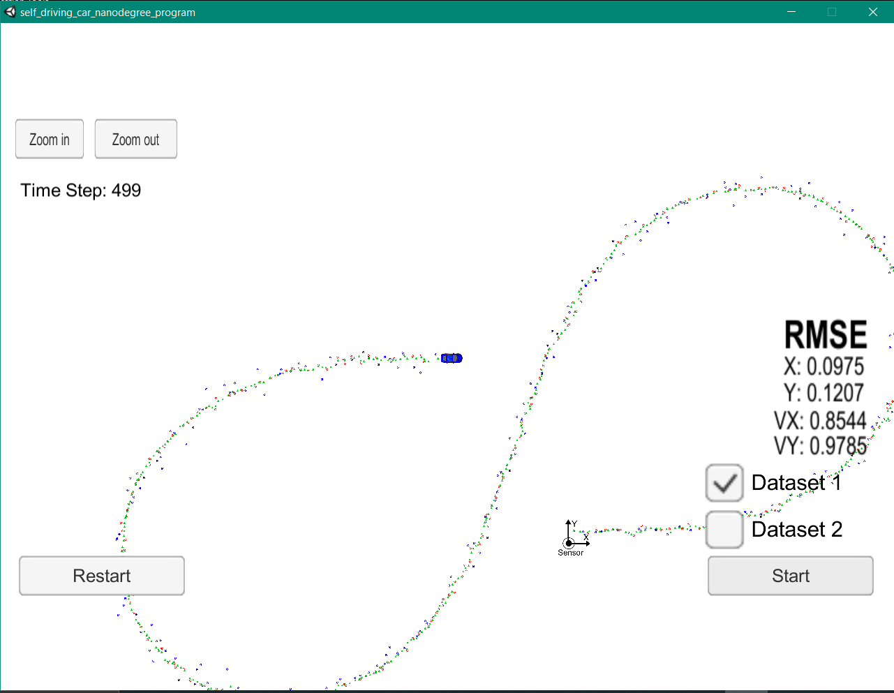
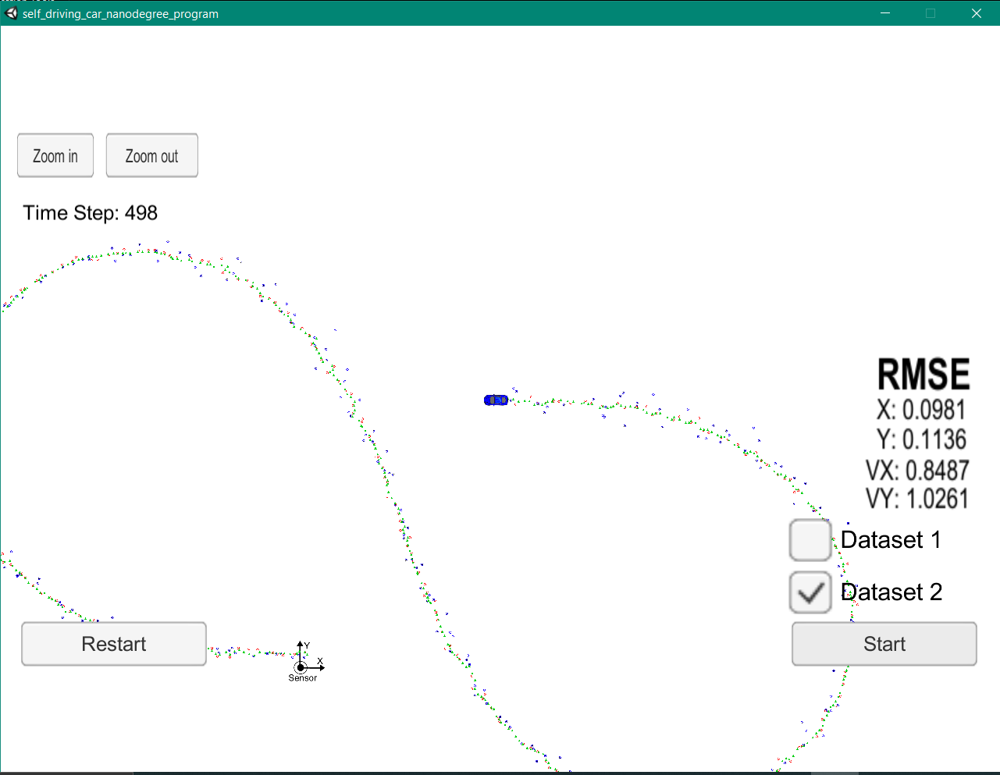

# Unscented Kalman Filter Project
Self-Driving Car Engineer Nanodegree Program

In this project utilize an Unscented Kalman Filter to estimate the state of a moving object of interest with noisy lidar and radar measurements. Passing the project requires obtaining RMSE values that are lower that the tolerance outlined in the project rubric. 

This project involves the Term 2 Simulator which can be downloaded [here](https://github.com/udacity/self-driving-car-sim/releases).

This repository includes two files that can be used to set up and intall [uWebSocketIO](https://github.com/uWebSockets/uWebSockets) for either Linux or Mac systems. For windows you can use either Docker, VMware, or even [Windows 10 Bash on Ubuntu](https://www.howtogeek.com/249966/how-to-install-and-use-the-linux-bash-shell-on-windows-10/) to install uWebSocketIO. Please see the uWebSocketIO Starter Guide page in the classroom within the EKF Project lesson for the required version and installation scripts.

Once the install for uWebSocketIO is complete, the main program can be built and ran by doing the following from the project top directory.

1. mkdir build
2. cd build
3. cmake ..
4. make
5. ./UnscentedKF

Tips for setting up your environment can be found in the classroom lesson for the EKF project.

Note that the programs that need to be written to accomplish the project are src/ukf.cpp, src/ukf.h, tools.cpp, and tools.h

The program main.cpp has already been filled out, but feel free to modify it.

Here is the main protocol that main.cpp uses for uWebSocketIO in communicating with the simulator.

INPUT: values provided by the simulator to the c++ program

["sensor_measurement"] => the measurment that the simulator observed (either lidar or radar)

OUTPUT: values provided by the c++ program to the simulator

["estimate_x"] <= kalman filter estimated position x
["estimate_y"] <= kalman filter estimated position y
["rmse_x"]
["rmse_y"]
["rmse_vx"]
["rmse_vy"]

---

## Other Important Dependencies
* cmake >= 3.5
  * All OSes: [click here for installation instructions](https://cmake.org/install/)
* make >= 4.1 (Linux, Mac), 3.81 (Windows)
  * Linux: make is installed by default on most Linux distros
  * Mac: [install Xcode command line tools to get make](https://developer.apple.com/xcode/features/)
  * Windows: [Click here for installation instructions](http://gnuwin32.sourceforge.net/packages/make.htm)
* gcc/g++ >= 5.4
  * Linux: gcc / g++ is installed by default on most Linux distros
  * Mac: same deal as make - [install Xcode command line tools](https://developer.apple.com/xcode/features/)
  * Windows: recommend using [MinGW](http://www.mingw.org/)

## Basic Build Instructions

1. Clone this repo.
2. Make a build directory: `mkdir build && cd build`
3. Compile: `cmake .. && make`
4. Run it: `./UnscentedKF`

## Code Style

Please stick to [Google's C++ style guide](https://google.github.io/styleguide/cppguide.html) as much as possible.

## Generating Additional Data

This is optional!

If you'd like to generate your own radar and lidar data, see the
[utilities repo](https://github.com/udacity/CarND-Mercedes-SF-Utilities) for
Matlab scripts that can generate additional data.

# Overview

## UKF

### CTRV Model
CTRV model stand for Constant turning rate and velocity. Therefore, PhiDot and V are constants.
The state of the rover are: Px, Py, V, Phi, and PhiDot. By including the process noise such as the noise from acceleration and turning, we have addition two variable, resulting in state vector of size 7.

### Generating Sigma Points
UKF use multiples point to estimated the state of the rover. Those points are sigma points. The number of sigma points required depend on the size of the state vector. 

The point will take into account the variance and the mean of the point to create a genarally uniform data around that distribution, giving a good estimate of the state. 

### Predicting Sigma Points
After generating sigma points, we predict the new sigma points from the motion model and the process noise by simply input it into the model function.

### Predicting State Mean and Variance
Using the predicted sigma points, now we can find the mean and variance of the predicted state. Note that the process noise does not effect the prediction of mean and variance anymore because it is already considered during prediciting the predicted sigma points process.

To find the mean and covariance, we will also need to weight each points. The first point will be given a higher weight because it represent the mean of the distribution.

### Predictig New State from Sensor Measurement
After getting mean and variance, we use the sensor measurement to update our state even further.

## Result

The accuracy of the UKF is lower than 0.2. In theory, by using UKF you have more point for estimation. Thus, giving a better estimation than EKF